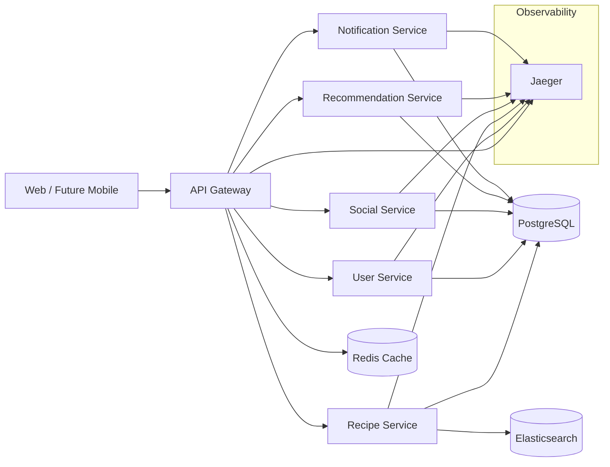

# System Architecture Overview (Initial)

## Context
Early bootstrap architecture for campus recipe platform targeting scalable microservices. Focus: clear boundaries, evolvable event-driven core, and observability readiness.

## High-Level Diagram (Mermaid)

## Request Flow (Example: Get Recipe)
1. Client -> GET /api/recipes/:id
2. Gateway validates JWT (future) & adds trace headers
3. Gateway proxies to Recipe Service
4. Recipe Service fetches recipe (Postgres) + optional cache
5. Response returned via Gateway

## Event Model (Planned)
Key events: user.registered, recipe.created, recipe.liked, follow.created, comment.created, recommendation.served.
Early stage: synchronous REST; later: introduce message broker (Kafka) for async propagation (indexing, feed fan-out, recommendations feedback).

## Scaling Paths
- Read Scaling: Add Postgres replicas; introduce query router & read-only endpoints.
- Write Scaling: Partition comments/likes by recipe_id hash; user-centric tables by user_id.
- Caching: Redis for hot recipes & feed pages.
- Search: Elasticsearch index updated on recipe mutations.

## Security Layers
- Gateway: authN, rate limiting, header sanitation.
- Services: scope validation, least-privilege DB roles.

## Future Evolution
- Replace Gateway with Envoy + declarative policies
- Add Kafka event backbone
- Introduce ML feature store + vector search
